Php Bitirme Projesi
<html>
<head><meta http-equiv=Content-Type content="text/html; charset=UTF-8">

</head>
<body>

İnternet Programcılığı-II

Final Ödevi

Ad Soyad

:

Taha Yasin KÖKSAL

İÇİNDEKİLER

øçindekiler

1.Genel Tanıtım

1

2.Veritabanı Yapısı

2

2.1 Ayar Tablosu

2

2.2 Görünüm Tablosu

3

2.3 Haberler Tablosu

3

2.4 Kategori Tablosu

4

2.5 İletişim Tablosu

4

2.6 Reklam Tablosu

5

2.5 Slider Tablosu

5

2.6 Üyeler Tablosu

5

2.7 Video Tablosu

6

3. Kullanıcı Sayfaları

7

3.1 Son Haberler sayfası

7

3.2 Haber   etayı Sayfası

7

3.3 Hakkımızda Sayfası

8

3.4 İletişim Sayfası

8

3.5 Sol ve Sağ Modül

9

3.6 En Çok Görüntülenen Haberler

9

3.7 Öne Çıkan Videolar

9

4. Yönetici Sayfaları

10

5. Dinamik sayfalar

13

5.1 Hakkımızda Sayfası

13

5.2 İletişim Sayfası

13

5.3 İletişim Formu

13

5.4 İletişim Formu

13

5.5 Bilgilendirme Metni

13

5.6 Kategorilerin Listelenmesi

14

5.7 Sayfalama Butonları

14

5.8 Haber ve Video   etayları

14

5.9 Yeni Üye Mail   oğrulaması

14

5. Nasıl Yaptım?

15

1

1.  Genel Tanıtım

Ödevimin konusu dinamik bir şekilde çalışan, kullanıcı dostu, mobil uyumlu ve göze

güzel görünen profesyonel haber sitesi geliştirmek.

Sitemin hedef kitlesine kullanıcı gözüyle bakacak olursak haber okumak isteyen,

video haber izlemek isteyen herkesin seveceği bir haber sitesidir.

Bir diğer bakış açısıyla bakar isek, kendine profesyonel bir haber sitesi açmak isteyen,

kod bilgisi bilmeyen ve sitenin her şeyine müdahale etmek isteyen kişiler rahatlıkla

kullanabilir.

Site adresi: <A HREF="https://tahayasinkoksal.com.tr/php/">https://tahayasinkoksal.com.tr/php/</A> 

Site yönetici paneli adresi: <A HREF="https://tahayasinkoksal.com.tr/php/admin/giris.php">https://tahayasinkoksal.com.tr/php/admin/</A> 

Sitemde 2 farklı yetkide kullanıcı var. Bunlar yönetici ve yazar.

Yönetici giriş bilgileri:

Mail:    yonetici@yonetici.com

-   Parola: 123123

Yazar giriş bilgileri:

Mail:    yazar@yazar.com

-   Parola: 123123

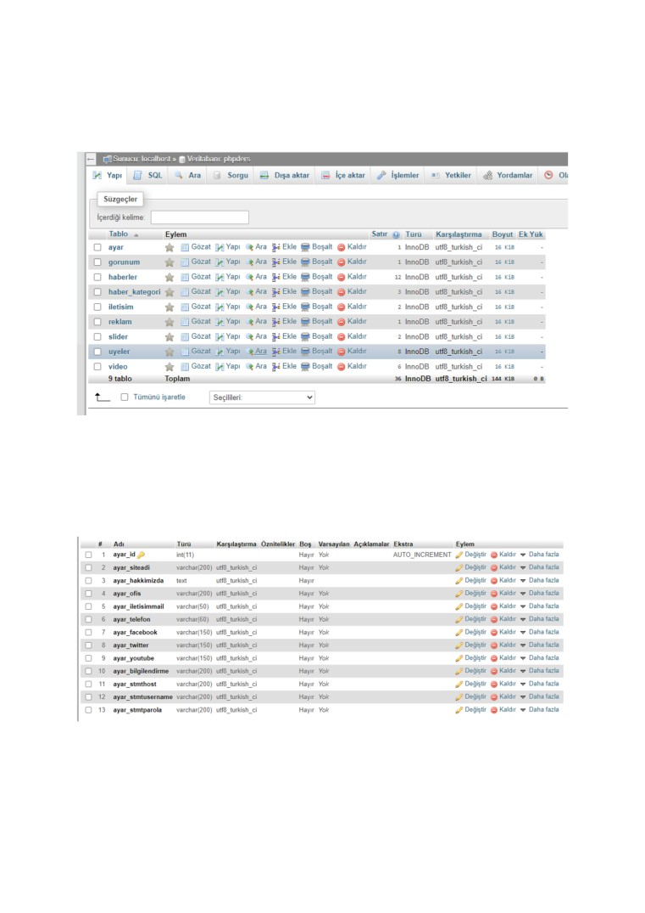

2

2.Veritabanı Yapısı

Projemde toplamda 9 tane tablo bulunmakta, bunlar aşağıdaki gibidir;

2.1 Ayar Tablosu

Ayar tablomda sitemdeki tekil veriye sahip olan verileri tutmaktayım. Bunlar haber

sitesinin sosyal medya hesapları, hakkımda verisi, iletişim verileri, iletişim mail adresi,

telefon (vb.) gibi bir tane satır veri içeren tablodur.

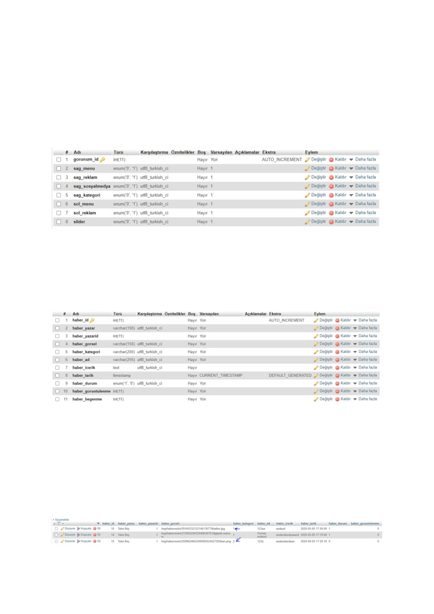

3

2.2 Görünüm Tablosu

Bu tabloda sitenin görünümüyle alakalı verileri tutmaktayım. Mesela site yöneticisi

sitenin sağ kısmında reklam göstermek istemez ise oradaki reklamı kapatabiliyor. Yine bunun

gibi sitenin sağında ve solunda sosyal medya butonlarını, en çok beğenilen haberleri,  kategori

panelini ve bilgilendirme metni gibi kısımları koda müdahale etmeden kaldırabilir.

Tabloda 1 ve 0 verisi saklanmakta, 1 tasarımda seçilen modülün açık olduğunu, 0 ise

kapalı olduğu anlamına gelir.

2.3 Haberler Tablosu

Bu tablomda ise bütün haber verilerini tutmaktayım. Haber adı, haber içeriği, haber

tarihi, haberin aktif veya pasif olma durumunu, görüntülenme ve beğenme sayısını,

kategorisini, görselini gibi daha saymadığım birçok veriyi tutuyorum.

Aynı zamanda bu tabloda diğer bir tabloda bulunan benzersiz bir id verisini tutmaktayım,

şöyle ki;

Haber tablomda haber_kategori sütununda kategori olarak direkt kategori adını değil

kategorinin id’sini tutmaktayım. Bunu yapma nedenim eğer ki kategorinin adı değişirse

buradaki veri de değiştirilmek zorunda kalmasın, bu yüzden burada kategori verisinin adını

değil id verisini tutmaktayım.

Haber tablomdan veri örneği:

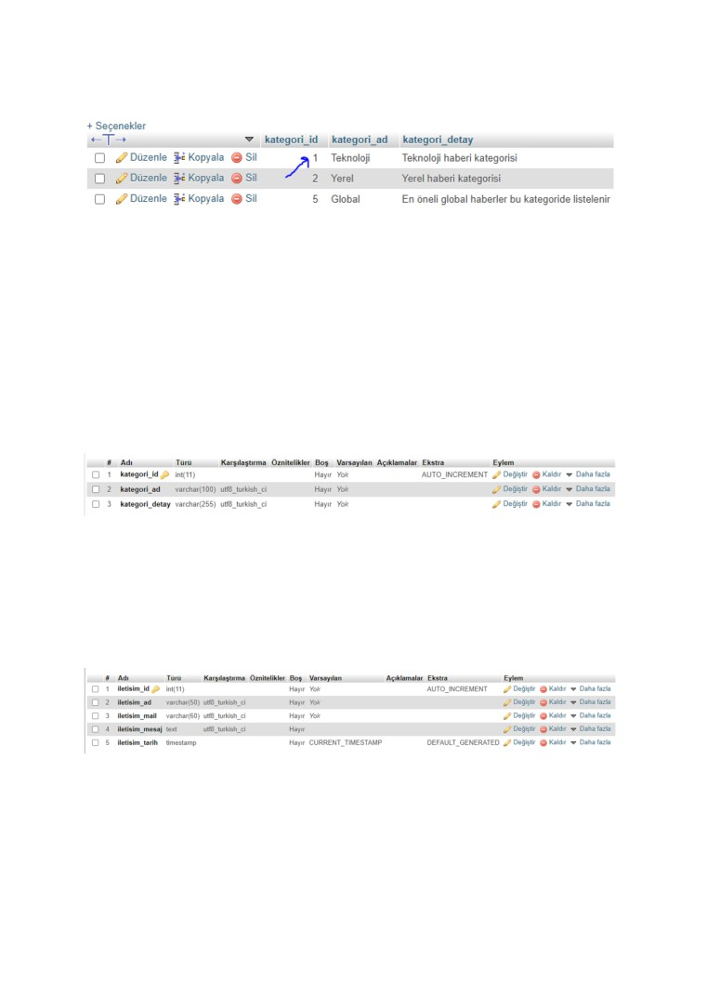

4

Kategori tablomda veri örneği:

2.4 Kategori Tablosu

Bu tabloda kategori adını ve detayını tutmaktayım, haber paylaşımı yapan yazarlar

seçeceği kategorinin detayına bakarak kategori seçimini daha kolay ve anlaşılır yapmasını

sağlamaktayım.

Bir önceki haber tablomda da anlattığım gibi bu tablomda kategorimin adını

değiştirirsem direkt olarak diğer tabloda kategori adını değil de kategori id’si verisini tutuğum

için otomatikman haber tablomda da kategori adı verisi değişecek.

Yani bu tablolardaki veriler, 2 tablodaki harmanlanmış veriyi içermekte.

2.5 øletişim Tablosu

Bu tabloda ise kullanıcıların yöneticilerle iletişim kurmasını sağladım. øletişim

formuna girilen veriler bu tabloda tutulmakta. Genel olarak mesaj gönderen kişinin adını,

mesaja tekrar cevap verilmek istenirse diye gönderenin mail adresini, mesajını ve mesajı

gönderme zamanını tutmaktayım.

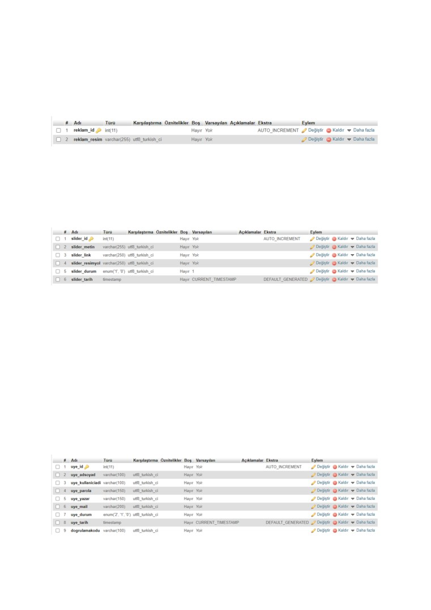

5

2.6 Reklam Tablosu

Bu tablomda siteye reklam vermek isteyen insanların reklam verilerini tutmaktayım.

Haber sitemi gerçek bir haber sitesi senaryosunu düşünerek yaptım. Site yöneticisinin sitesine

reklam almasını ve para kazanmasını sağladım. Bu tablodaki tuttuğum veri sadece reklam

verisinin resminin yolu.

2.5 Slider Tablosu

Bu tabloda sitenin ana sayfasındaki resimli kaydırılan slider kısmındaki verileri

tutuyorum. Slider üzerinde yazan metin, üzerine tıkladığında gidilecek adres, slider resmi,

durumu ve slider oluşturma tarihini tutmaktayım.

2.6 Üyeler Tablosu

Bu tablo sitenin bel kemiği tablosu diyebilirim çünkü siteye giriş yapıp haber

paylaşmak için siteye üye olmamız gerekli, bu yüzden çok önemli bir tablo. Tabloda üye olan

kişinin adını, soyadını, parolasını yazar ise yazar adını, mail adresini, üyelik durumunu, üye

olduğu tarihini ve mail adresini doğrulayabilmesi için doğrulama kodunu tutmaktayım.

hyelik durumu kısmını biraz açmam gerekirse bir kullanıcı sitenin üye olma

kısmından üye olunduğunda otomatikman kullanıcının durumu pasif olarak ayarlanıyor ve

sistem benzersiz bir sayı üreterek doğrulama kodu kısmında kaydediyor.

Sonrasında üye olunan mail adresine bir doğrulama url adresi göndererek hesabını

doğrulaması gerekiyor. Hesabını doğrulayan kullanıcının durumu pasif konumdan yazar

konumuna taşınıyor. Artık üye girişi yapıp haber paylaşabilir. Daha detaylı bilgiyi ileriki

bölümlerde anlatacağım.

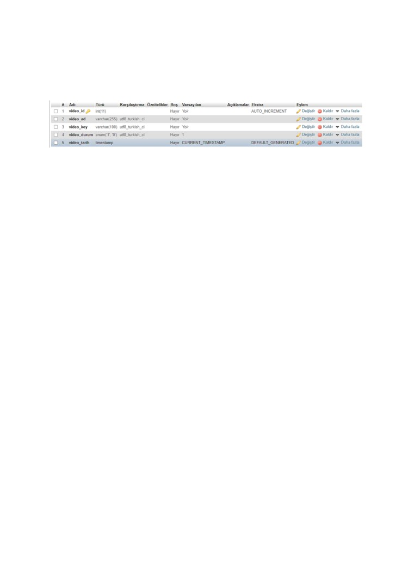

6

2.7 Video Tablosu

Bu tabloda ise Youtube üzerinden video haber paylaşımı yapabilmek için veriler

tutuyorum. Paylaşılacak video haberin adını, videoyu tanımlayan key verisini, aktif veya pasif

olduğuna dair durum verisini ve son olarak paylaşım yapılan tarih verisini tutuyorum.

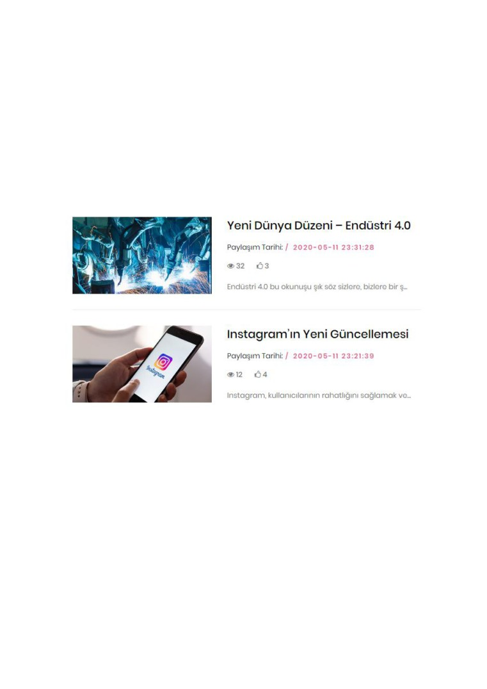

7

3. Kullanıcı Sayfaları

Bu bölümde sitemin kullanıcı kısmı hakkında bilgilere yer vereceğim.

3.1 Son Haberler sayfası

Bu sayfada paylaşılan bütün haberleri listelemekteyim. Sayfanın alt kısmında

sayfalama butonlarım bulunmakta. Ve sitenin sağ tarafında bulunan kategori seçimi yapılarak

bu sayfada sadece seçilen kategorilerin listelenmesini sağlayabiliriz.

Genel olarak haberin resmi, adı, tarihi, beğeni sayısı, görüntülenme sayısı

listelenmekte.

3.2 Haber Detayı Sayfası

Bir önceki kısımda (3.1) anlattığım sayfadan herhangi bir habere tıklandığında detay

sayfasına gidebiliriz.

Bu sayfada üzerine tıklanılan haberin görseli adı, görüntülenme ve beğeni sayısı,

haberin detaylı içeriği yer almakta. Ve aynı zamanda bu sayfayı ziyaret ettikçe veri

tabanındaki görüntülenme sayısı artmaktadır. Hemen haber görselinin altındaki beğeni

butonuna tıklanarak haberi beğenebiliriz.

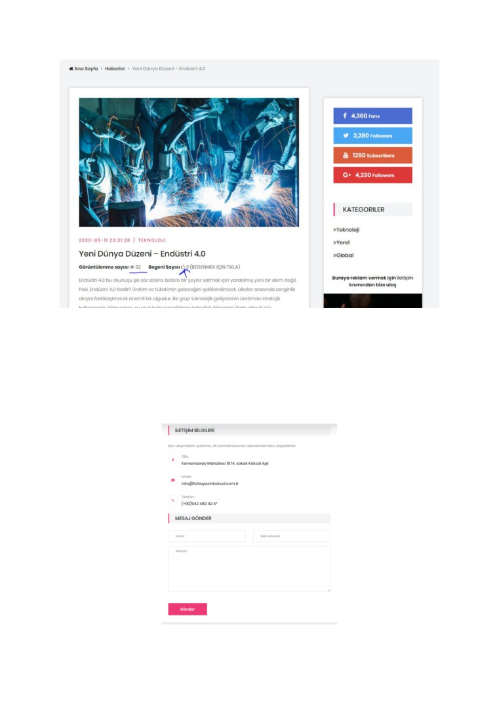

8

3.3 Hakkımızda Sayfası

Site yöneticisinin girdiği haber sitesinin hakkında veriler listelenmekte.

3.4 øletişim Sayfası

Site yöneticisine mesaj göndermek isteyen kullanıcıların iletişim kurmaları için

yapılmış sayfadır.

9

3.5 Sol ve Sağ Modül

Sitenin sağında ve solunda olan kısımlardır. østeğe bağlı olarak kullanıcının bu

kısımları kapatıp açabilir. Buralarda en çok beğenilen 6 haber, reklam alanı, sosyal medya

butonları ve kategori modülü yer almakta.

3.6 En Çok Görüntülenen Haberler

Burada en çok görüntülenme alan 6 haber listelenmekte. Haberin resmi ve adı

yazmakta, tıklandığında haber detayına gidilmekte.

3.7 Öne Çıkan Videolar

Site yazarlarının paylaştığı Youtube videoları haberleri listelenmekte. Videonun ön

izlemesi ve adı yer almakta. hzerine tıklandığında yine video haber detayı sayfasına gidip

videoyu izleyebiliriz.

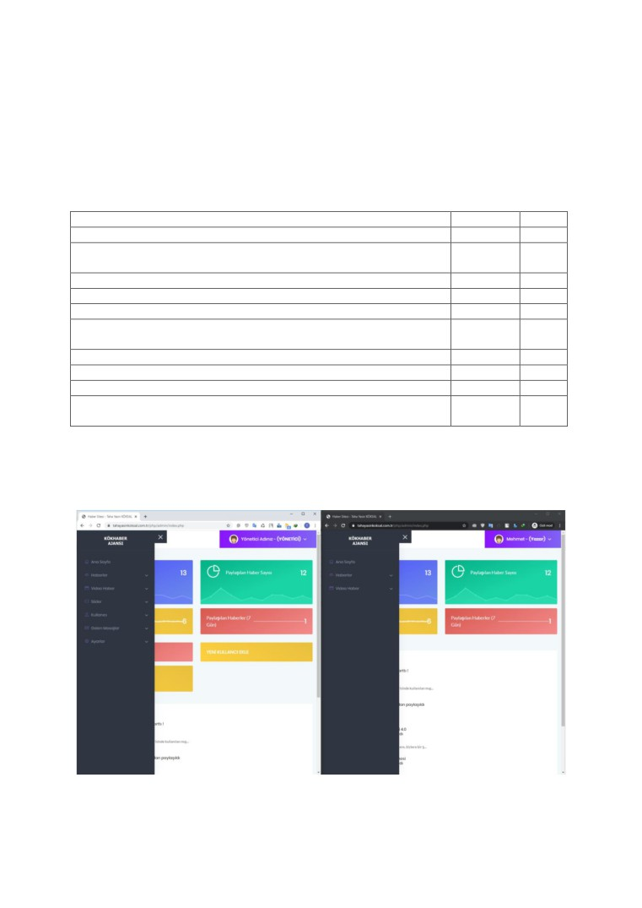

10

4. Yönetici Sayfaları

Yönetici sayfalarına girebilmek için önceden de söylediğim gibi 2 farklı yetkide

üyeliğimiz olduğunu ve sitede değişiklik yapabilmemiz için (tasarım, hakkında sayfası, sosyal

medya hesapları vb.) yönetici yetkisine sahip bir üyelikle giriş yapmamız gerekmekte.

Kısaca üyelerin yapabilecekleri şunlar;

Yetkileri

Yönetici

Yazar

Yeni haber ekleme

+

+

Tüm ekli olan haberler üzerinde değişim yapma (Yazar sadece kendi

+

-

eklediği haberde değişim yapabilir)

Yeni kategori ekleme

+

-

Kategori işlemleri (silmek, değişiklik yapmak)

+

-

Video haber paylaşma

+

+

Video haber işlemleri (silmek, değişiklik yapmak - yazar sadece kendi

+

-

paylaştığı)

Slider işlemleri (ekleme, düzenleme, silme)

+

-

Kullanıcı işlemleri  (ekleme, düzenleme, silme)

+

-

Gelen mesajlar (inceleme)

+

-

Site ayarı yapabilme (tasarım, reklam, sosyal medya ayarları, mail

+

-

ayarları, hakkımızda verileri vb.)

Şimdi hem yönetici hem de yazar girişi yapıp menülerin görünümüne bakalım.

Sol taraftaki yönetici girişi yapmış bir üyelik, sağ taraftaki yazar giriş yapmış.

Gördüğümüz gibi yöneticinin yetkileri çok daha fazla, yazarın yapabilecekleri ise kısıtlanmış.

Peki yazar yetkisi olmadığı bir sayfayı ziyaret etmeye çalışırsa ne olur?

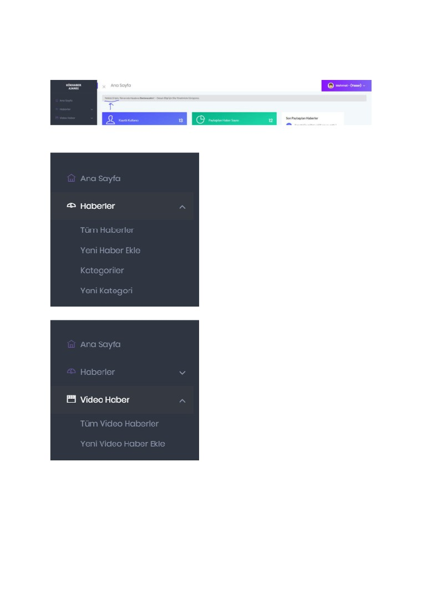

11

Resimde de görüldüğü gibi otomatikman ana sayfaya yönlendirdi ve kullanıcıyı

uyardı.

Şimdi yönetici yetkisi olan hesaptan neler yapılabileceğine bakalım.

- Haberler sekmesini kullanarak yeni haber

ekleyip silebiliriz. Yazarlar ise sade kendi

paylaştığı haberleri görebilir ve işlem yapabilir.

-Yine haberler sekmesi altından yeni kategori

ekleyip düzenleme yapabiliriz. Yazarlar sadece

mevcut kategorileri görebilir, işlem yapamaz.

- Video haber sekmesinde ise Youtube üzerinde

video çekerek video haber eklenebilir. Nasıl

ekleneceğine detaylı dair bilgi ekleme

sayfasında yazmakta.

-Bu sayfaya yazarlar tarafından da erişilebilir.

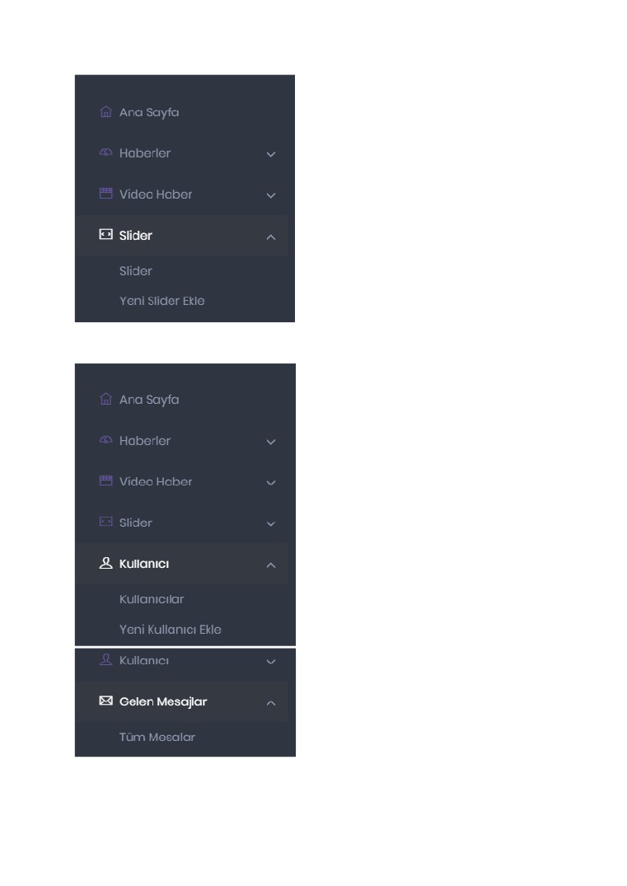

12

-Slider sekmesinde ana sayfada bulunan slider

kısmına ekleme yapılabilir.

-Bu işlemi sadece yönetici yapabilir.

-Kullanıcı sekmesi siteye yeni kullanıcı

eklemek için bir diğer yöntem.

-Yeni kullanıcı ekleyebiliriz, şifresini unutan

kullanıcılar için yeni şifre belirleyebiliriz

veyahut kullanıcı banlayıp, kullanıcının

yetkisini değiştirebiliriz.

-Bu sayfaya sadece yöneticiler erişebilir.

- Gelen mesajlar menüsünde de kullanıcıların

yöneticiye gönderdiği mesajlar, reklam vermek

isteyenler gibi mesajlar yer almakta.

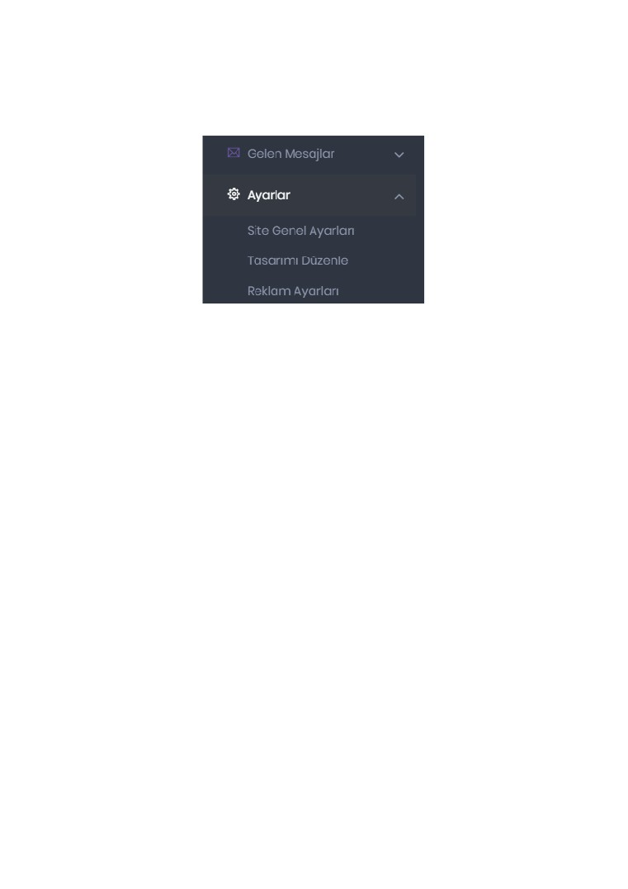

13

Ayarlar menüsünde ise site hakkında gerşeye müdahale edebiliriz. Hakkımzda

sayfasındaki metne, iletişim sayfasındaki telefon numarası, mail adresi, site tasarımını komple

değiştirebiliriz, sitemize reklam alabiliriz.

5. Dinamik sayfalar

5.1 Hakkımızda Sayfası

Yönetici site ayarlarından istediği gibi hakkında sayfasındaki metni düzenleyebilir,

bunun için kod bilmesine gerek yok.

5.2 øletişim Sayfası

Yine yönetici iletişim sayfasındaki ofis adresini, mail adreslerini, cep telefonu

numarasını dinamik bir şekilde değiştirebilir.

5.3 øletişim Formu

Kullanıcılar yöneticiye mesaj göndermek için iletişim sayfasının en altında yer alan

formu doldurarak yöneticiye ulaşabilir gönderebilir.

5.4 øletişim Formu

Yönetici sitenin sağında ve solunda olan reklam alanlarına istediği gibi resimli reklam

yayınlayabilir.

5.5 Bilgilendirme Metni

Yönetici sitenin sağ tarafındaki modülün en altında yer alan bilgilendirme alanındaki

metni istediği gibi düzenleyebilir, hatta isterse orasını köşe yazılarını paylaştığı alan olarak ta

kullanabilir.

14

5.6 Kategorilerin Listelenmesi

Sitenin sağ tarafında ve footer kısmında (sayfanın en altı), oluşturulan bütün

kategoriler listelenmekte. Yönetici yeni bir kategori eklediğinde otomatikman burada

listelenir.

5.7 Sayfalama Butonları

Yine dinamik bir şekilde çalışan bir kısımda sayfalama butonları kullanıcı 1. sayfadan

2. sayfaya geçiş yapmak isterse direkt olarak 2 ye tıklayabilir.

5.8 Haber ve Video Detayları

Herhangi bir habere veya video adına tıklandığında tıklanılan içerik hakkında detaylı

bilgiyi yeni açılan sayfada görebiliriz.

5.9 Yeni hye Mail Doğrulaması

Yeni üye olan kişilerin üyeliğini aktif edebilmesi için mail doğrulaması yapması

gerekmektedir. Bunu nedeni siteye her üye olanın girip haber paylaşmasının önüne geçmek ve

spam üyelikleri yok etmek.

hye girişi kısmının hemen altındaki kayıt ol butonunda tıklanması yeterli, gerekli

bilgileri doldurup üye ol butonunda tıklandıktan sonra mail 5 dakika içinde üye olunan adrese

gelmekte. Mail bazen gelen kutusu yerine spam kutusuna düşmekte.

15

5. Nasıl Yaptım?

➢   Bu projeyi geliştirmeye başlamadan önce hali hazırda olan haber sitelerini incelemeye

başladım. Can alıcı özellikleri, olmazsa olmaz kısımları not aldım.

➢   Veri tabanı yapımı düşündüm not aldım, planladığım senaryoda olması gereken tablolar

ve verileri düşündüm ve madde madde not aldım.

➢   Sonrasında ise profesyonel bir haber sitesi tasarım arayıp buldum. Gerekli kısımlar kaldı

gereksiz kısımları çıkardım.

➢   Yine ön kısım gibi yönetici kısmı içinde ücretsiz profesyonel bir tasarım buldum.

Ve senaryomu hayata geçirmeye başladım.

Projemi geliştirirken birçok sorunla karşılaştım ve bir çoğunun çözümünü bulmam

bayağı zor oldu.

Mesela sayfalama kısmını yapmıştım gayet iyi çalışmaktaydı, sonrasında işin içine

sayfalama ve sadece seçilen kategori girince bayağı bi zor oldu işin içinden çıkmam.

Çözümüm ise şu şekilde oldu, kategori get verisi ile gelmekteydi buraya kadar bi

sıkıntı yok ilk sayfada seçilen kategoriye ait 5 tane veri listeleniyor, sayfa numaralarından 2.

sayfaya gittiğimde ise seçilen kategoriye ait veriler gelmiyordu. Bende sayfa numarasına eğer

ki önceden kategori seçilirse bunu algılayıp kategori verisini 2. sayfa içinde kullanılmasını

sağladım. Bu şekilde sorunumu çözmüş oldum.

Benim projemin bana kalırsa en güzel özelliği yeni açılan üyeliklerde mail doğrulama

özelliğinin olması, çünkü bu işlem bayağı teferruatlı gibi şöyle ki bu işlem;

Kullanıcı üye olma sayfasına gidiyor gerekli bilgileri yazıyor, sonrasında sistem onu

veri tabanına kaydediyor ve üyelik durumunu banlı olarak işaretliyor.

Veri tabanına sadece kullanıcının verileri kaydolmuyor, kayıt sırasında rand()

fonksiyonu kullanılarak rastgele bir sayı oluşturuyorum ve bu sayıyı da veri tabanına

kaydediyorum.

Sonrasında mail işlemlerini başlatıyorum mail içeriğine bir doğrulama linki

koyuyorum.

Link şu şekilde oluyor get verisi olarak 2 adet veri içeriyor mail ve doğrulama kodu.

Kullanıcı bu linke tıklayarak önceden oluşturduğum sayfaya gidiyor sayfa gelen get

verilerini yakalayıp sorguya sokuyor. Şartlar sağlanırsa kullanıcının veri tabında kaydedilmiş

olan yetkisini yazar olarak değiştiriyor. Bu sayede artık üye girişi yapabilir.

16

</body>
</html>
